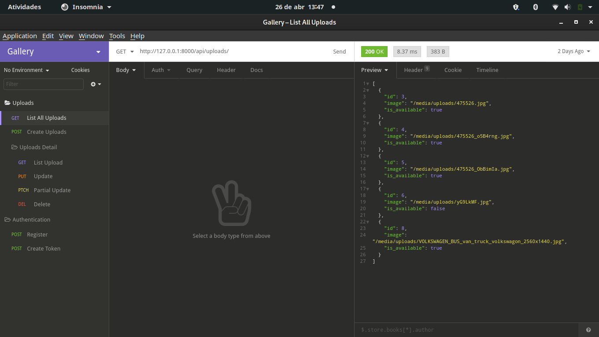
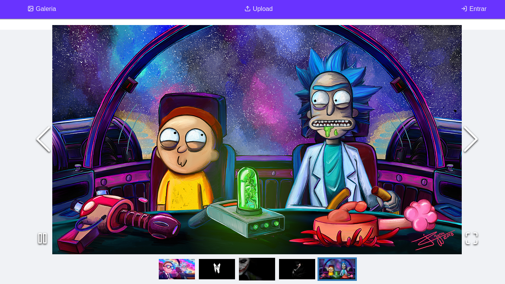
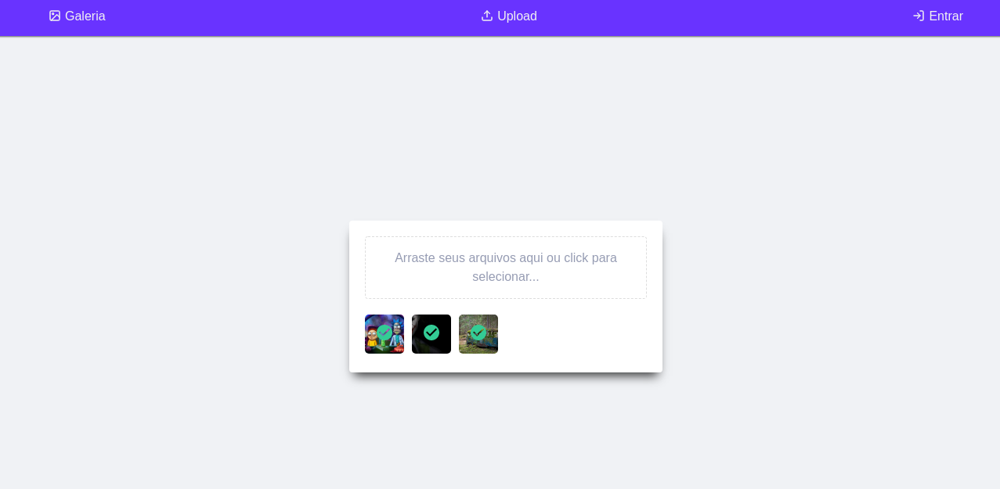

# Galeria de Imagens

Uma aplicação para visualizar suas imagens com múltiplo upload de imagens
e painel de administração.
API feita com Django e SPA com React JS.

<!-- TABLE OF CONTENTS -->
<details open="open">
  <summary><strong>TABLE OF CONTENTS</strong></summary>
  <ul>
    <li><a href="#screenshot">Screenshots</a></li>
    <li>
      <a href="#getting-started">Getting Started</a>
      <ul>
        <li><a href="#requirements">Requirements</a></li>
        <li><a href="#cloning">Cloning</a></li>
      </ul>
    </li>
    <li><a href="#setup">Setup</a></li>
    <li><a href="#tests">Tests</li>
    <li><a href="#technologies">Technologies</a></li>
  </ul>
</details>

## Screenshots

| API | Insomnia |
|----------------------|-------------------------------|
|||

| Galeria | Uploads |
|---------|---------|
|||


## Getting Started

### Requirements

- [Python](https://www.python.org/)
- [Node](https://nodejs.org/en/)
- [NPM](https://www.npmjs.com) ou [Yarn](https://yarnpkg.com)

### Cloning
- Clonando o repositório

  ```sh
  
    $ git clone https://github.com/foschieraanderson/gallery-django-react.git

  ```

## Setup

### Vamos começar subindo a API

  - Entre na pasta do projeto
    ```sh
      $ cd gallery-django-react
    ```
  - Inicie um ambiente virtual com sua ferramenta de preferência, eu vou usar **poetry**
    
    ```sh
    # Com o ambiente ativado vamos instalar as dependências

     $ poetry install

    ```

  - Gere uma secret_key para o seu projeto através do seu terminal
    
    ```sh
    # gerando SECRET_KEY
      $ python -c "import secrets; print(secrets.token_urlsafe())"
    ```
  - No diretório *api* edite o arquivo **settings**
    
    ```sh

    # Editando o arquivo settings.py

      # Cole a sua secret_key aqui
      - SECRET_KEY=YOUR_SECRET_KEY

    ```

  - Criando as tabelas no banco de dados
    
    ```sh
    # Gravando as alterações nas migrations

     $ poetry run python manage.py makemigrations

    # Gerando as tabelas

     $ poetry run python manage.py migrate

    ```
  - Rodando a API
    
    ```sh
    # Iniciando o servidor django

     $ poetry run python manage.py runserver

    ``` 
  - Neste momento você consegue acessar a api através do seu navegador no endereço **http://127.0.0.1:8000**

  - Você vai querer acessar o painel administrativo na rota **http://127.0.0.1:8000/admin** e para isso você vai precisar de um *usuário*
    
    ```sh
    # Criando um usuário

     $ poetry run python manage.py createsuperuser

    ``` 
  
### Agora podemos iniciar nosso frontend

  - Entre na pasta do projeto
    ```sh
      $ cd web/
    ``` 
  - Instalando as dependências da aplicação
    ```sh
      $ yarn install
    ``` 
  - Rodando a aplicação web
    ```sh
      $ yarn start
    ``` 
  - Nesse momemnto a sua aplicação está rodando no endereço **http://127.0.0.1:3000**

## Tests

  - Vamos rodar os testes para garantir que está tudo conforme o esperado
  ```sh
    $ poetry run pytest
  ```

## Technologies

* [Python](https://www.python.org)
* [Django](https://www.djangoproject.com)
* [Django Rest Framework](https://www.django-rest-framework.org)
* [SQLite](https://www.sqlite.org/index.html)
* [Swagger](https://swagger.io)
* [Poetry](https://python-poetry.org)
* [React](https://pt-br.reactjs.org)
* [Typescript](https://www.typescriptlang.org)
* [Yarn](https://yarnpkg.com)
* [Styled-components](https://styled-components.com)


---

<h4 align="center"> <em>&lt;/&gt;</em> <a href="https://github.com/foschieraanderson" target="_blank">foschieraanderson</a> </h4>
