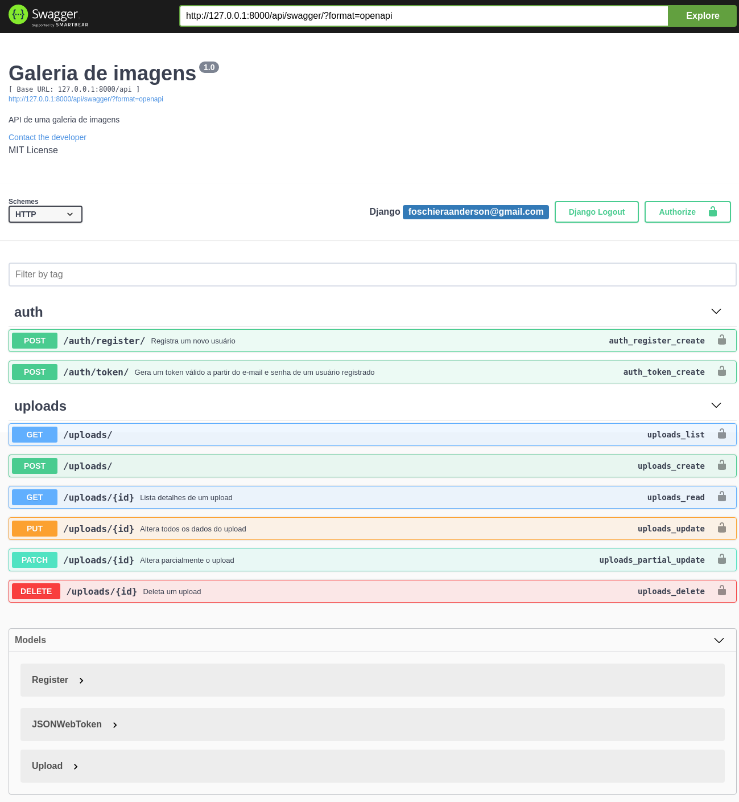

# Galeria de Imagens

Uma aplicação para visualizar suas imagens com multiplo apload de imagens
e painel de administração.API feita com Django e SPA com React JS.

<!-- TABLE OF CONTENTS -->
<details open="open">
  <summary><strong>TABLE OF CONTENTS</strong></summary>
  <ul>
    <li><a href="#camera-screenshot">Screenshots</a></li>
    <li>
      <a href="#pushpin-getting-started">Getting Started</a>
      <ul>
        <li><a href="#key-requirements">Requirements</a></li>
        <li><a href="#minidisc-installation">Installation</a></li>
      </ul>
    </li>
    <li><a href="#hammer_and_wrench-setup">Setup</a></li>
    <li><a href="#desktop_computer-technologies">Technologies</a></li>
    <li><a href="#page_with_curl-license">License</a></li>
  </ul>
</details>

## Screenshots

| API | Insomnia |
|----------------------|-------------------------------|
|||

| Galeria | Uploads |
|---------|---------|
|||


## Getting Started

### Requirements

- [Docker](https://www.docker.com/)
- [Python](https://www.python.org/)
- [Node](https://nodejs.org/en/)
- [NPM](https://www.npmjs.com) ou [Yarn](https://yarnpkg.com)

### Installation
- Clonando o repositório

  ```sh
  
    $ git clone https://github.com/foschieraanderson/gallery-django-react.git

  ```

## Setup

### Vamos começar subindo a API

  - Entre na pasta do projeto
    ```sh
      $ cd gallery-django-react
    ```
  - Inicie seu ambiente virtual de preferência eu vou usar **poetry**
    
    ```sh
    # Com o ambiente ativado vamos instalar as dependências

     $ poetry install

    ```

  - Gere uma secret_key para o seu projeto através do seu terminal
    
    ```sh
    # gerando SECRET_KEY
      $ python -c "import secrets; print(secrets.token_urlsafe())"
    ```
  - No diretório *api* edite o arquivo **settings**
    
    ```sh

    # Editando o arquivo settings.py

      # Cole a sua secret_key aqui
      - SECRET_KEY=YOUR_SECRET_KEY

    ```

  - Criando as tabelas no banco de dados
    
    ```sh
    # Gravando as alterações

     $ poetry run python manage.py makemigrations

    # Gerando as tabelas

     $ poetry run python manage.py migrate

    ```
  - Rodando a API
    
    ```sh
    # Iniciando o servidor django

     $ poetry run python manage.py runserver

    ``` 
  - Neste momento a api está rodando no seu navagador no endereço **http://127.0.0.1:8000**
  
### Agora podemos iniciar nossa aplicação

  - Entre na pasta do projeto
    ```sh
      $ cd web/
    ``` 
  - Instalando as dependências da aplicação
    ```sh
      $ yarn install
    ``` 
  - Rodando a aplicação web
    ```sh
      $ yarn start
    ``` 
  - Nesse momemnto a sua aplicação está rodando no endereço **http://127.0.0.1:3000**

## Technologies

* [Python](https://www.python.org)
* [Django](https://www.djangoproject.com)
* [Django Rest Framework](https://www.django-rest-framework.org)
* [Postgres](https://www.postgresql.org)
* [Swagger](https://swagger.io)
* [Poetry](https://python-poetry.org)
* [React](https://pt-br.reactjs.org)
* [Typescript](https://www.typescriptlang.org)
* [Yarn](https://yarnpkg.com)
* [Styled-components](https://styled-components.com)


---

<h4 align="center"> <em>&lt;/&gt;</em> <a href="https://github.com/foschieraanderson" target="_blank">foschieraanderson</a> </h4>